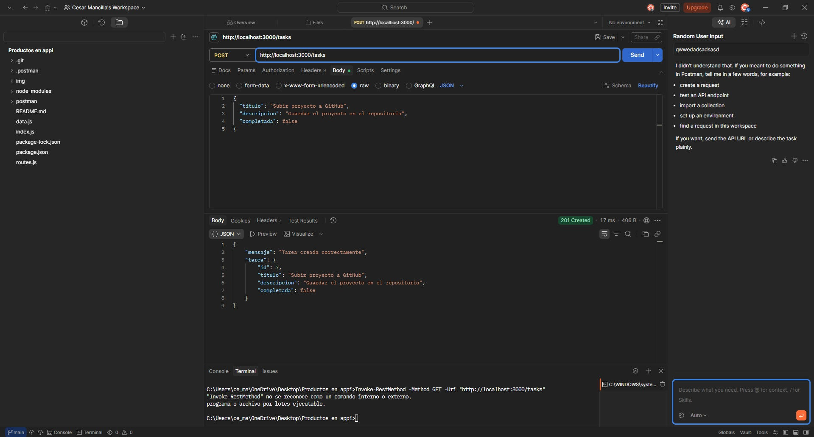
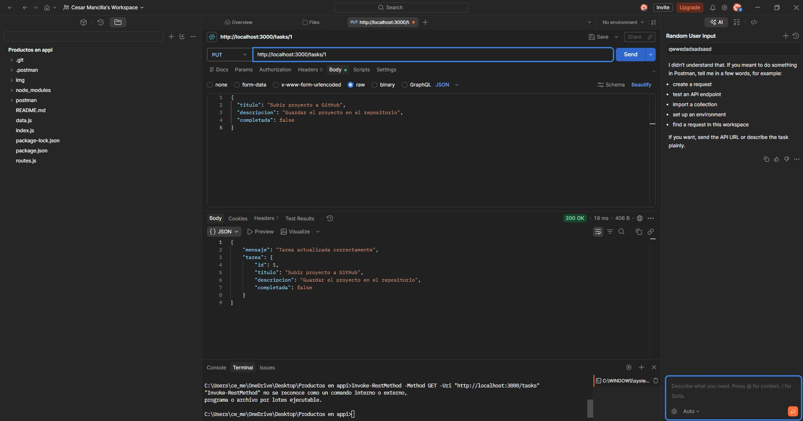
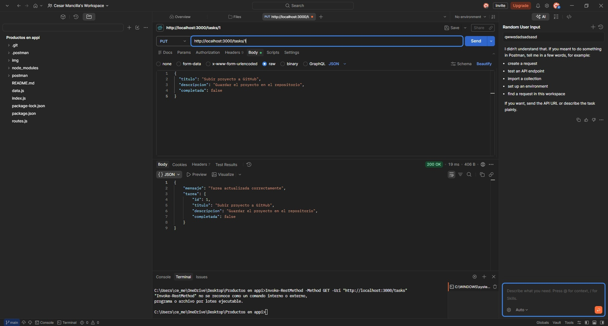
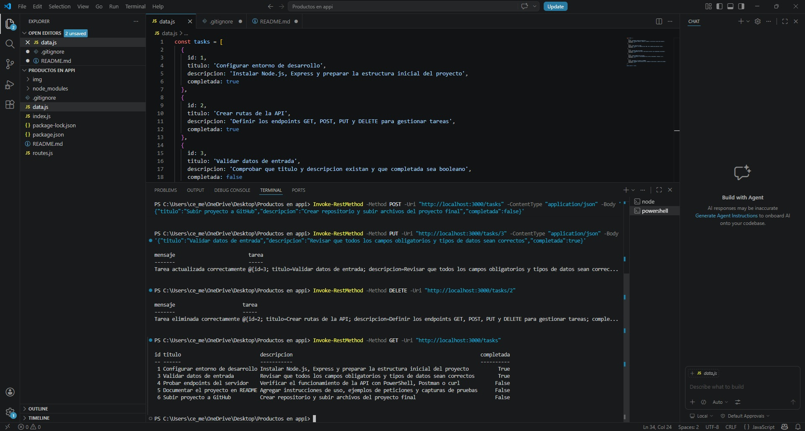

Mi primera API 
Descripción
Este proyecto consiste en una API RESTful básica desarrollada con Node.js y Express.js para gestionar tareas mediante operaciones CRUD (Crear, Leer, Actualizar y Eliminar) [file:1]. Los datos se almacenan en un archivo externo data.js, utilizando un arreglo de objetos, sin base de datos, tal como exige la evaluación [file:1].
Objetivo
El objetivo es comprender cómo se estructura un servidor con Express, cómo manejar rutas y métodos HTTP, y cómo enviar y recibir datos en formato JSON [file:1]. También se busca aplicar validaciones básicas, manejo de errores y organización del proyecto en archivos separados [file:1].
Estructura del proyecto
mi-primera-api-express/
├── index.js
├── routes.js
├── data.js
├── package.json
└── README.md

Tecnologías utilizadas
•	Node.js
•	Express.js
•	PowerShell o Postman para pruebas
•	JSON como formato de intercambio de datos [file:1]
Instalación
1.	Descargar o clonar el repositorio.
2.	Abrir la carpeta del proyecto en Visual Studio Code.
3.	Ejecutar el siguiente comando en la terminal:
npm install

Ejecución del servidor
Para iniciar el servidor, ejecutar:
npm start

Si todo está correcto, aparecerá el siguiente mensaje en consola:
Servidor corriendo en http://localhost:3000

Endpoints disponibles
Método	Endpoint	Descripción
GET	/tasks	Lista todas las tareas
POST	/tasks	Crea una nueva tarea
PUT	/tasks/:id	Actualiza una tarea existente
DELETE	/tasks/:id	Elimina una tarea existente

Datos iniciales del proyecto
El archivo data.js contiene tareas relacionadas con el desarrollo y documentación de una API backend, usando nombres más naturales y coherentes con el contexto del trabajo:
const tasks = [
  {
    id: 1,
    titulo: 'Configurar entorno de desarrollo',
    descripcion: 'Instalar Node.js, Express y preparar la estructura inicial del proyecto',
    completada: true
  },
  {
    id: 2,
    titulo: 'Crear rutas de la API',
    descripcion: 'Definir los endpoints GET, POST, PUT y DELETE para gestionar tareas',
    completada: true
  },
  {
    id: 3,
    titulo: 'Validar datos de entrada',
    descripcion: 'Comprobar que titulo y descripcion existan y que completada sea booleano',
    completada: false
  },
  {
    id: 4,
    titulo: 'Probar endpoints del servidor',
    descripcion: 'Verificar el funcionamiento de la API con PowerShell, Postman o curl',
    completada: false
  },
  {
    id: 5,
    titulo: 'Documentar el proyecto en README',
    descripcion: 'Agregar instrucciones de uso, ejemplos de peticiones y capturas de pruebas',
    completada: false
  }
];

Validaciones implementadas
La API valida lo siguiente antes de crear o actualizar una tarea [file:1]:
•	titulo es obligatorio.
•	descripcion es obligatoria.
•	completada debe ser booleano (true o false).
•	Si faltan campos o los datos son inválidos, responde con código 400 [file:1].
•	Si el recurso no existe, responde con código 404 [file:1].
Códigos HTTP utilizados
•	200: operación exitosa.
•	201: recurso creado correctamente.
•	400: datos inválidos o incompletos [file:1].
•	404: recurso no encontrado [file:1].
Ejemplos de pruebas
La evaluación solicita incluir ejemplos de petición y respuesta JSON para GET, POST, PUT y DELETE, además de pantallazos de las pruebas [file:1].
1. GET - Listar todas las tareas
Petición:
Invoke-RestMethod -Method GET -Uri "http://localhost:3000/tasks"

Respuesta JSON esperada:
[
  {
    "id": 1,
    "titulo": "Configurar entorno de desarrollo",
    "descripcion": "Instalar Node.js, Express y preparar la estructura inicial del proyecto",
    "completada": true
  },
  {
    "id": 2,
    "titulo": "Crear rutas de la API",
    "descripcion": "Definir los endpoints GET, POST, PUT y DELETE para gestionar tareas",
    "completada": true
  },
  {
    "id": 3,
    "titulo": "Validar datos de entrada",
    "descripcion": "Comprobar que titulo y descripcion existan y que completada sea booleano",
    "completada": false
  },
  {
    "id": 4,
    "titulo": "Probar endpoints del servidor",
    "descripcion": "Verificar el funcionamiento de la API con PowerShell, Postman o curl",
    "completada": false
  },
  {
    "id": 5,
    "titulo": "Documentar el proyecto en README",
    "descripcion": "Agregar instrucciones de uso, ejemplos de peticiones y capturas de pruebas",
    "completada": false
  }
]

Pantallazo de prueba GET:

2. POST - Crear una nueva tarea
Petición:
Invoke-RestMethod -Method POST -Uri "http://localhost:3000/tasks" -ContentType "application/json" -Body '{"titulo":"Subir proyecto a GitHub","descripcion":"Crear repositorio y subir archivos del proyecto final","completada":false}'

Respuesta JSON esperada:
{
  "mensaje": "Tarea creada correctamente",
  "tarea": {
    "id": 6,
    "titulo": "Subir proyecto a GitHub",
    "descripcion": "Crear repositorio y subir archivos del proyecto final",
    "completada": false
  }
}

Pantallazo de prueba POST:

3. PUT - Actualizar una tarea
Petición:
Invoke-RestMethod -Method PUT -Uri "http://localhost:3000/tasks/3" -ContentType "application/json" -Body '{"titulo":"Validar datos de entrada","descripcion":"Revisar que todos los campos obligatorios y tipos de datos sean correctos","completada":true}'

Respuesta JSON esperada:
{
  "mensaje": "Tarea actualizada correctamente",
  "tarea": {
    "id": 3,
    "titulo": "Validar datos de entrada",
    "descripcion": "Revisar que todos los campos obligatorios y tipos de datos sean correctos",
    "completada": true
  }
}

Pantallazo de prueba PUT:

4. DELETE - Eliminar una tarea
Petición:
Invoke-RestMethod -Method DELETE -Uri "http://localhost:3000/tasks/2"

Respuesta JSON esperada:
{
  "mensaje": "Tarea eliminada correctamente",
  "tarea": {
    "id": 2,
    "titulo": "Crear rutas de la API",
    "descripcion": "Definir los endpoints GET, POST, PUT y DELETE para gestionar tareas",
    "completada": true
  }
}

Pantallazo de prueba DELETE:

Pantallazo de prueba DELETE:

5. GET final - Verificación final
Este GET final se realizó después de probar POST, PUT y DELETE, para comprobar que los cambios quedaron aplicados correctamente en la lista de tareas.

Petición:

powershell
Invoke-RestMethod -Method GET -Uri "http://localhost:3000/tasks"
Pantallazo de verificación final:

Flujo de la aplicación
1.	index.js inicializa el servidor Express.
2.	express.json() permite recibir y procesar datos JSON.
3.	routes.js contiene la lógica de las operaciones CRUD.
4.	data.js almacena el arreglo de tareas en memoria [file:1].
5.	La API responde con JSON y utiliza códigos HTTP adecuados según el resultado de cada operación [file:1].
Decisiones de diseño
•	Se utilizó Express.js porque es el framework solicitado por la evaluación [file:1].
•	Se separó el proyecto en archivos para cumplir con la estructura mínima requerida [file:1].
•	Se trabajó con un archivo externo data.js en lugar de base de datos, tal como se solicita [file:1].
•	Se usaron títulos y descripciones de tareas más naturales para dar mayor autenticidad al proyecto.
•	Se implementaron validaciones y manejo de errores para cumplir con la rúbrica [file:1].
Conclusión
La API desarrollada cumple con los requisitos de la evaluación: uso de Express.js, estructura organizada, almacenamiento en archivo externo, operaciones CRUD, validaciones básicas, respuestas JSON y documentación de pruebas [file:1]. Además, se incorporaron pantallazos reales de funcionamiento en el README.md
