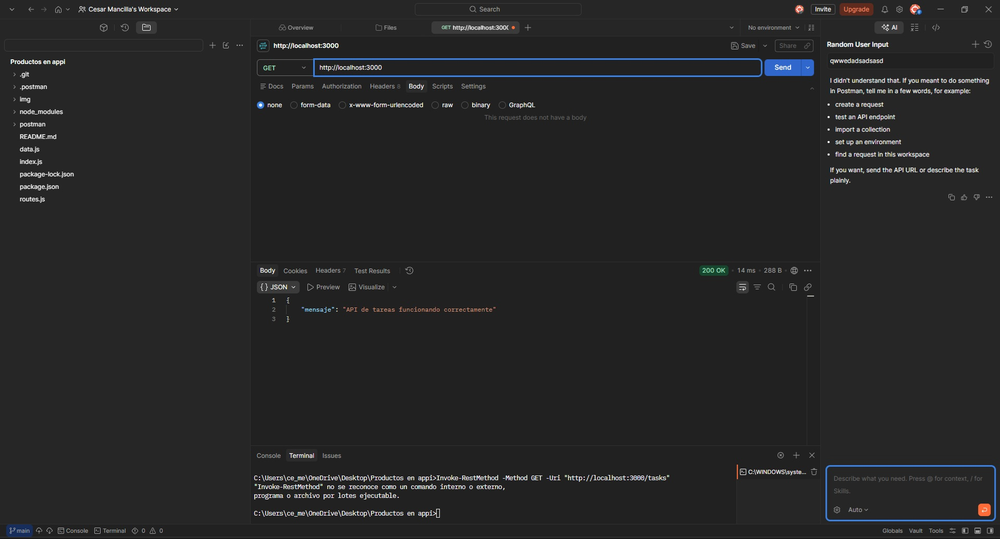

# Mi primera API 

API RESTful básica desarrollada con Node.js y Express para gestionar tareas mediante operaciones CRUD.  
El proyecto almacena los datos en un archivo JavaScript externo y permite probar los endpoints con Postman.

## Descripción

Esta API permite crear, listar, actualizar y eliminar tareas.  
Cada tarea contiene los campos:

- id
- titulo
- descripcion
- completada

La aplicación fue creada como parte de una evaluación de programación backend, cumpliendo con los métodos HTTP GET, POST, PUT y DELETE, el uso de JSON y la documentación de pruebas en el README [file:1].

## Tecnologías utilizadas

- Node.js
- Express.js
- Postman

## Estructura del proyecto

```bash
.
├── data.js
├── index.js
├── routes.js
├── package.json
└── README.md
```

## Instalación

1. Clona el repositorio.
2. Instala las dependencias:

```bash
npm install
```

## Ejecución

Para iniciar el servidor, usa:

```bash
node index.js
```

Si tu proyecto tiene un script en `package.json`, también puedes usar:

```bash
npm start
```

El servidor se ejecutará en:

```bash
http://localhost:3000
```

## Endpoints disponibles

- `GET /tasks` → listar todas las tareas.
- `POST /tasks` → crear una nueva tarea.
- `PUT /tasks/:id` → actualizar una tarea existente.
- `DELETE /tasks/:id` → eliminar una tarea existente.

## Ejemplos de uso

### GET /tasks

Devuelve todas las tareas registradas.

### POST /tasks

Crea una nueva tarea enviando un JSON con los campos requeridos.

### PUT /tasks/:id

Actualiza una tarea existente usando su `id`.

### DELETE /tasks/:id

Elimina una tarea existente usando su `id`.

## Pruebas con Postman

A continuación se muestran las pruebas realizadas con Postman para verificar el funcionamiento de la API RESTful. Cada endpoint responde con JSON y permite ejecutar las operaciones CRUD solicitadas en la evaluación [file:1][web:96].

### 1. GET /tasks

**Descripción:** Lista todas las tareas registradas.

**Petición en Postman:**
- Método: `GET`
- URL: `http://localhost:3000/tasks`

**Captura:**


### 2. POST /tasks

**Descripción:** Crea una nueva tarea.

**Petición en Postman:**
- Método: `POST`
- URL: `http://localhost:3000/tasks`
- Body: `raw` → `JSON`

```json
{
  "titulo": "Subir proyecto a GitHub",
  "descripcion": "Guardar el proyecto en el repositorio",
  "completada": false
}
```

**Captura:**


### 3. PUT /tasks/:id

**Descripción:** Actualiza una tarea existente.

**Petición en Postman:**
- Método: `PUT`
- URL: `http://localhost:3000/tasks/1`
- Body: `raw` → `JSON`

```json
{
  "titulo": "Subir proyecto a GitHub",
  "descripcion": "Actualizar el proyecto en el repositorio",
  "completada": true
}
```

**Captura:**


### 4. DELETE /tasks/:id

**Descripción:** Elimina una tarea existente.

**Petición en Postman:**
- Método: `DELETE`
- URL: `http://localhost:3000/tasks/1`

**Captura:**


### 5. GET final /tasks

**Descripción:** Verificación final para comprobar que los cambios quedaron aplicados.

<<<<<<< HEAD
**Petición en Postman:**
- Método: `GET`
- URL: `http://localhost:3000/tasks`

**Captura:**

=======
Flujo de la aplicación
1.	index.js inicializa el servidor Express.
2.	express.json() permite recibir y procesar datos JSON.
3.	routes.js contiene la lógica de las operaciones CRUD.
4.	data.js almacena el arreglo de tareas en memoria [file:1].
5.	La API responde con JSON y utiliza códigos HTTP adecuados según el resultado de cada operación [file:1].

Decisiones de diseño
•	Se utilizó Express.js porque es el framework solicitado por la evaluación [file:1].
•	Se separó el proyecto en archivos para cumplir con la estructura mínima requerida [file:1].
•	Se trabajó con un archivo externo data.js en lugar de base de datos, tal como se solicita [file:1].
•	Se usaron títulos y descripciones de tareas más naturales para dar mayor autenticidad al proyecto.
•	Se implementaron validaciones y manejo de errores para cumplir con la rúbrica [file:1].

Conclusión
La API desarrollada cumple con los requisitos de la evaluación: uso de Express.js, estructura organizada, almacenamiento en archivo externo, operaciones CRUD, validaciones básicas, respuestas JSON y documentación de pruebas [file:1]. Además, se incorporaron pantallazos reales de funcionamiento en el README.md
>>>>>>> edaeeeeaf146fe2eed58a35f2337e3fa74745133
